# VM Lifecycle on GCP and OCI — Tutorial

## Video Tutorials:
[GCP](https://drive.google.com/file/d/1a4BTrVuhYcnG6hstJIy5gzcCTQn4F0Ew/view?usp=sharing) \
[OCI](https://drive.google.com/file/d/1HGctj1jL_aiEZU82N-1RlUXmTbPR7pNa/view?usp=sharing)

## Prereqs
- Cloud access to GCP and OCI
- No PHI/PII; smallest/free-tier shapes

---

## Google Cloud (GCP)
 **pictures of each step are under the images and gcp folder* * 
### Create/Start VM
1. Go to [google cloud](https://console.cloud.google.com) and sign in
2. Make sure you created and selected a project
3. Click Create a VM

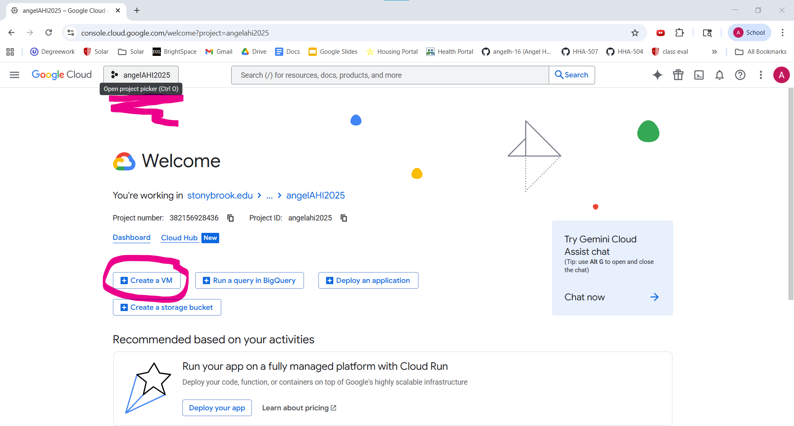

4. Give it a name under " Name* "
5. Chose a " Region* " and " Zone* " of your chose, better if it's a region near you
6. Scroll down and choose a Machine type
- In this case E2 (smallest available/free-eligible) and scroll down more and pick e2-micro

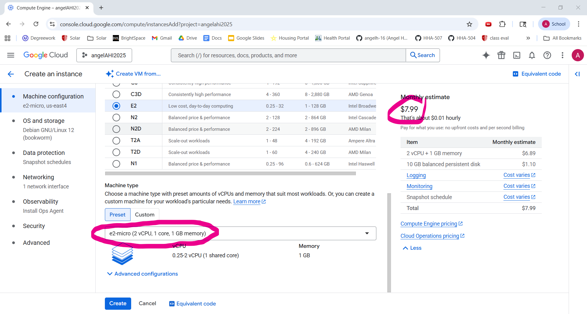

7. Then click " OS and storage "
8. Click " Change "
9. Under " Operating system ", click " Ubuntu " and then click " Select "

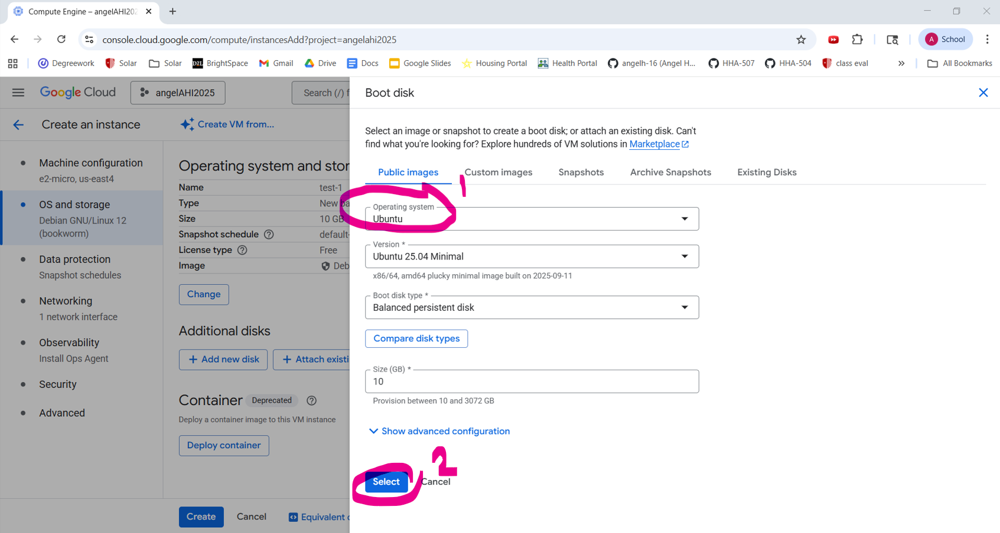

10. Others will remain at default
- Boot disk: default minimal
- Network: default VPC; ephemeral public IP
11. Click " Create "
- Once you see a green circle with a check next to the name of your VM, it is up and running

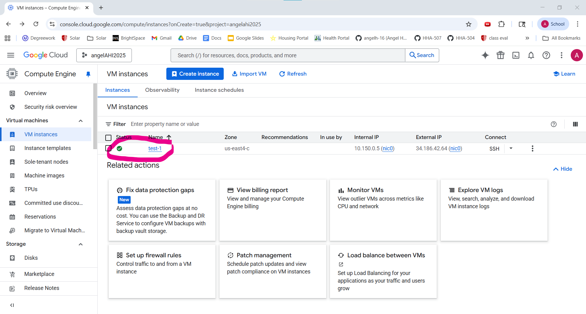

### Optional
12. Now click on the name of your VM
13. Click the " SSH " button and then " Authorize "
14. Type in "sudo apt-get update" and then enter
- This command updates the package lists for upgrades of packages that need upgrading
- Example: you can type " python3 " after to run python codes

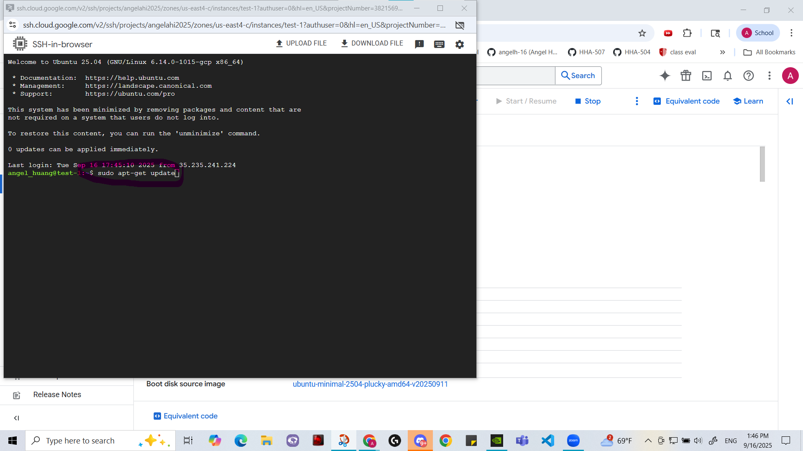

15. Type in "exit()" and then enter and close the tab to leave

### Stop VM
16. Click the back arrow next to the name of your VM
17. Click on the 3 dots
18. Click " Stop " and " Stop " again

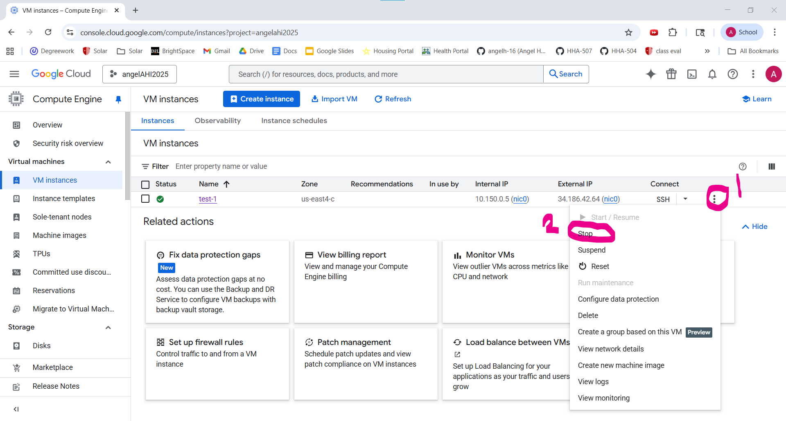

- Once it shows a gray circle with a white square, it means your VM has stopped running

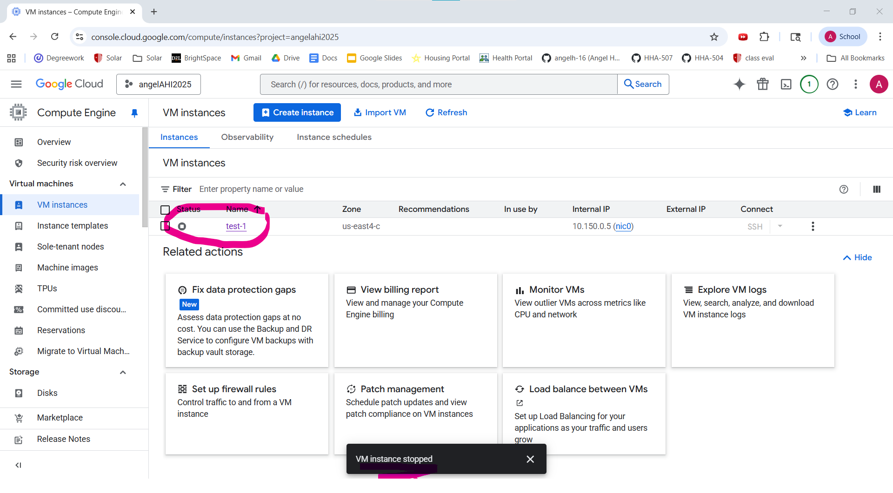

- To start it again you can click the 3 dots and click on " Start/Resume " and then go back to step 11

### Delete VM
19. To delete it, click the 3 dots again
20. Then click delete
21. Once it is deleted, you should not see it anymore under " VM instances "

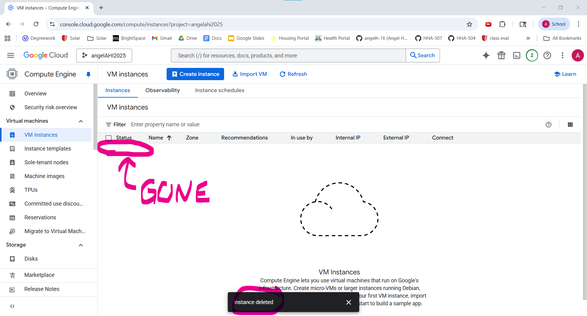

---

## Oracle Cloud (OCI)
**pictures of each step are under the images and oci folder* * 
### Create/Start VM
1. Go to [Oracle Cloud](https://www.oracle.com/cloud/) and sign in
2. Click " Create an instance " under " Build "

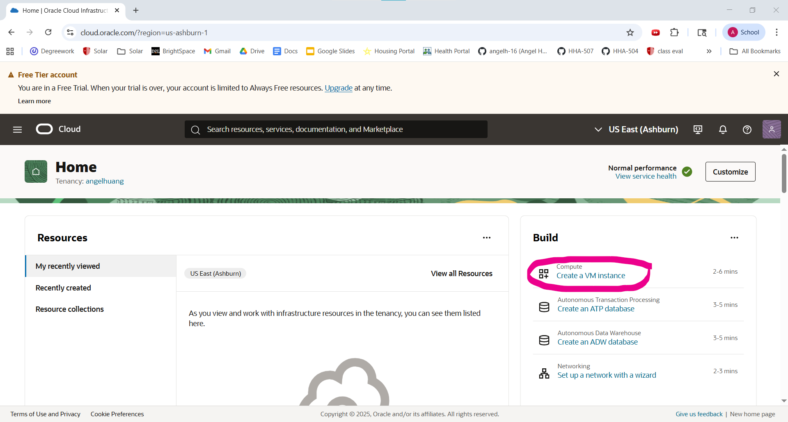

3. Give it a name
4. Scroll down and select a domain available to you (You should be fine with the default one)
- Networking: VCN with Internet Connectivity (defaults)
5. Scroll down and clcik " Change image "
6. Chose " Ubuntu " or " Oracle Linux "
7. Then click " Select image "
8. Scroll down and then click " Change shape "
9. Choose the smallest/free eligible
- Shape series: " Specialty and previous generation "
- Image: " VM.Standard.E2.1.Micro "
- Then click " Select shape "

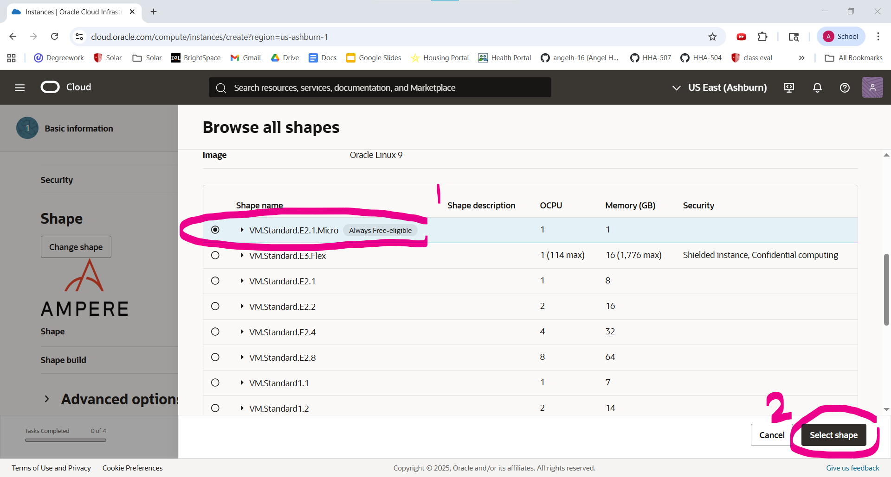

10. Click " Next " to move on to " Security "
11. Then click " Next " again to move on to " Networking "
12. Give the " VNIC name " a name
13. If you don't have a subnet, click " Create new public subnet "

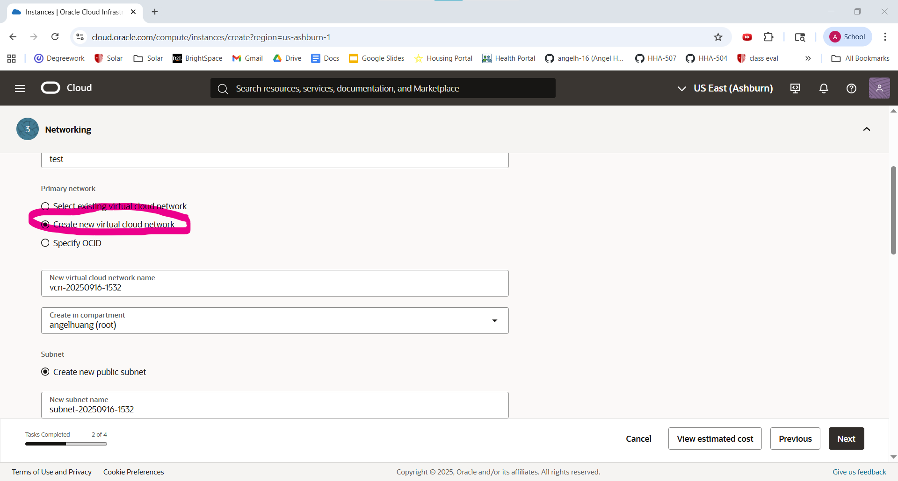

14. Click " Download private key" and " Download public key "
15. Click " Next " again to move on to " Networking "
16. Click " Next " again to move on to " Review "
17. Review all the information and see if you need to chang anything and then click " Create " when ready
18. Once it says " Succeded " in green under state, the VM is ready to run

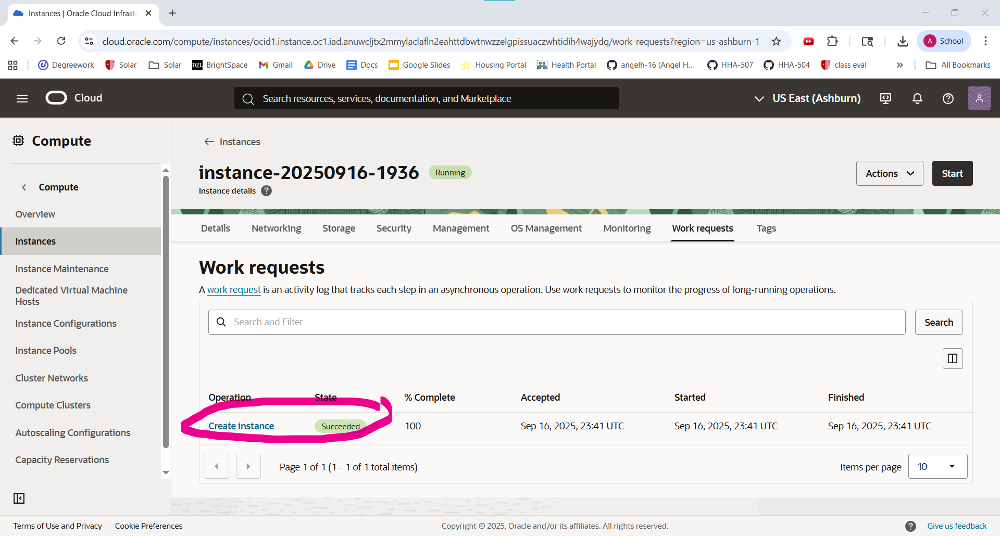

19. You can click " Start " to started the VM up or run it
20. It should show " Running " next to the name of your VM

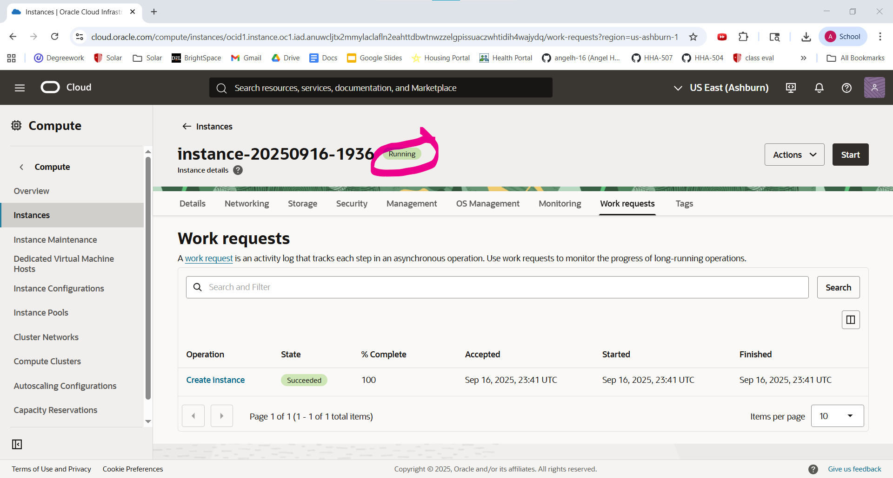

### Stop VM
21. Click on the pull down tab of " Actions " and then click " Stop "
22. Click " Stop instance "

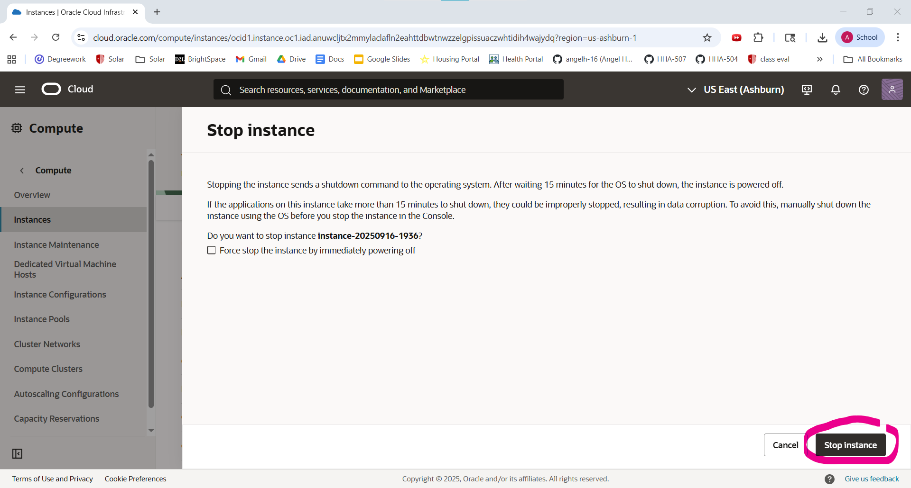

23. Once it shows the red " Stopped ", the VM has stopped running

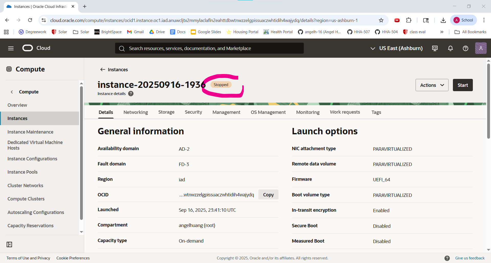

### Terminate VM
24. Click on the pull down tab of " Actions " and then click " Terminate "
25. Click " Terminate instance "
26. Once it shows the gray " Terminated ", the VM has been deleted

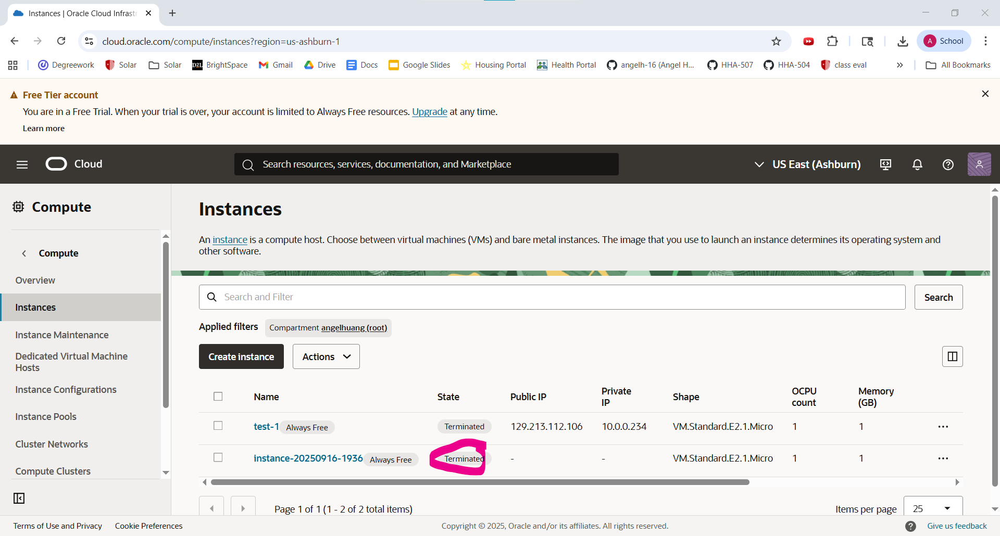

---

## Reflections
### Similarities
- Both have free trail and no billing informations required.
- Both have easy to navigate tabs on the home page.
- Both have descriptins of what each section does and the functions that come with it while navigating through the setup.
- Both have the settings choosing domains, operating systems, networking, and security settings.
- Both have free trail and no billing informations required.
- Both have the start, stop, monitor and delete VM buttons

### Differences
- OCI required a SSO sign in each time and logs you out when inactive while GCP is signed in automatically when you are signed into your email.
- Both have different UI setups: GCP had everything in tabs that u had to click on and go through on your choice while OCI had to have you scroll and click next on each section and makes you go through each step.
- Pricing and machine types are different.
- GCP was faster to load while OCI took a while.

### Preference (OCI vs GCP) and Why
- My preference would be Google Cloud (GCP) over Oracle Cloud (OCI). I like how user-friendly the UI is with GCP ad how fast the VM can be created, ran, stopped, and deleted. The OCI process took a lot longer and I had to wait for a while and cut out some time in the tutorial videos. I feel like GCP is a lot more beginner-friendly with the tabs on the side for users to go into and click out of while OCI you had to go through each one and scroll.
